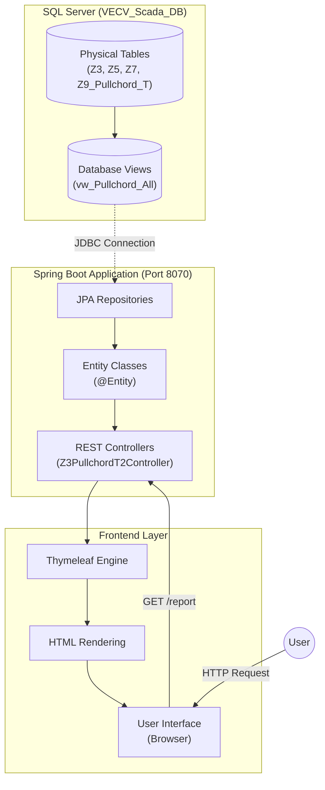

# VECV SCADA Pull Chord Report Viewer

## Overview
This project is a comprehensive SCADA reporting solution designed for VECV. It visualizes Pull Chord data from the shop floor, providing real-time insights into production efficiency, maintenance calls, and quality alerts. The application fetches data from a SQL Server database, processes it via a Spring Boot backend, and displays it on a dynamic Thymeleaf-based frontend.

## 🚀 Features
- **Real-time Reporting**: View live data from Z3, Z5, Z7, and Z9 Pullchord tables.
- **Dynamic Filtering**: Filter by Station, Shift (A, B, C), and Date/Time ranges.
- **Interactive Dashboard**: A modern dashboard with Key Performance Indicators (KPIs).
- **Excel Export**: Download detailed reports for offline analysis.
- **Responsive Design**: optimized for shop floor displays and desktop monitoring.

## 📊 System Architecture & Flow Chart

The following diagram illustrates the complete data flow from the physical database tables to the user interface.



## 🛠️ How It Works

### 1. Data Layer
The system connects to a **SQL Server** database (`VECV_Scada_DB`). Raw data from the PLC/SCADA systems is stored in normalized tables (e.g., `Z3_Pullchord_T2`). We use JPA Repositories to interact with these tables efficiently.

### 2. Backend Processing
The backend is built with **Spring Boot**.
- **Controllers**: Handle incoming HTTP requests and manage application routing.
- **Services/Repositories**: Execute SQL queries to fetch specific datasets based on user filters (Shift, Station, Time).
- **Model**: Data is mapped to Java Objects (Entities) for easy manipulation.

### 3. Frontend Visualization
Server-side rendering is handled by **Thymeleaf**.
- The `report.html` template dynamically renders tables based on the fetched data.
- The Dashboard (`KD_VECV_NewClientDemoUI.html`) embeds these reports and provides high-level metrics.
- Users can interact with the UI to drill down into specific production lines or download data.

## 💻 Technologies Used
- **Language**: Java 17
- **Framework**: Spring Boot 3.3.11
- **Database**: SQL Server
- **Template Engine**: Thymeleaf
- **Build Tool**: Maven
- **Frontend**: HTML5, CSS3, JavaScript

## 📥 Installation & Setup

### 1. Database Setup
The application connects to a SQL Server database. We have provided a script to set this up automatically.
1. Create a database named `VECV_Scada_DB` in your SQL Server.
2. Run the provided script **`database_setup.sql`** (located in the root folder) to create the required tables (`Z3_Pullchord_T2`, etc.) and dummy data.

### 2. Configure Connection
Open `src/main/resources/application.properties` and update your SQL Server credentials:
```properties
spring.datasource.url=jdbc:sqlserver://localhost:1433;databaseName=VECV_Scada_DB;encrypt=true;trustServerCertificate=true;
spring.datasource.username=sa
spring.datasource.password=YOUR_PASSWORD  <-- Update this
```

### 3. Run the Application
You can start the server using the included Maven wrapper:
```bash
./mvnw spring-boot:run
```
Once started, access the application at:
- **Dashboard**: [http://localhost:8070/dashboard](http://localhost:8070/dashboard)
- **Report Viewer**: [http://localhost:8070/report](http://localhost:8070/report)

*For a detailed step-by-step guide, please refer to [SETUP.md](SETUP.md).*

## 👥 Credits
Developed by **Koustubh Deodhar**.
